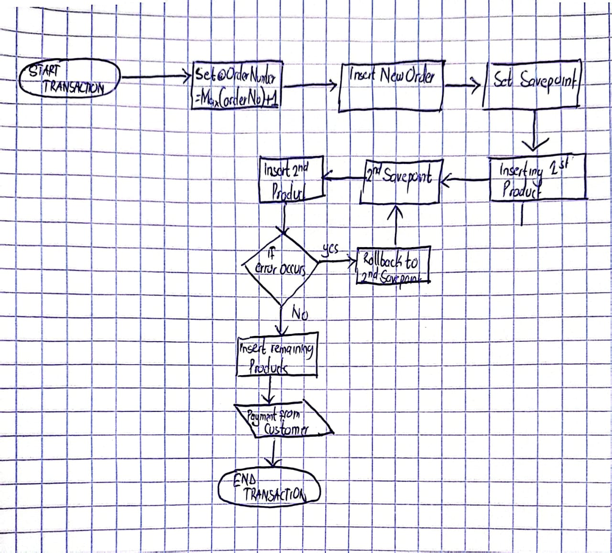

# BBT3104-Lab1of6-DatabaseTransactions

| **Key**                                                               | Value                                                                                                                                                                              |
|---------------|---------------------------------------------------------|
| **Group Name**                                                               | ? |
| **Semester Duration**                                                 | 19th August - 25th November 2024                                                                                                                       |

## Flowchart

## Pseudocode
BEGIN TRANSACTIONn

-- Step 1: Retrieve the latest order number
SET orderNumber = SELECT MAX(orderNumber) + 1 FROM orders;

-- Step 2: Iinsert a new order
INSERT INTO orders(orderNumber, orderDate, requiredDate, shippedDate, status, customerNumber, paymentStatus)
VALUES (orderNumber, current_date, add_days(current_date, 3), NULL, 'Pending', 145, 'Pending');

-- Step 3: Insert products and update stock

-- Product 1 insertion
INSERT INTO orderdetails(orderNumber, productCode, quantityOrdered, priceEach, orderLineNumber)
VALUES (orderNumber, 'S18_1749', 2724, 136, 1);

SET quantityInStock = SELECT quantityInStock FROM products WHERE productCode = 'S18_1749';
UPDATE products SET quantityInStock = quantityInStock - 2724 WHERE productCode = 'S18_1749';

-- Product 2 insertion
INSERT INTO orderdetails(orderNumber, productCode, quantityOrdered, priceEach, orderLineNumber)
VALUES (orderNumber, 'S18_2248', 540, 55.09, 2);

SET quantityInStock = SELECT quantityInStock FROM products WHERE productCode = 'S18_2248';
UPDATE products SET quantityInStock = quantityInStock - 540 WHERE productCode = 'S18_2248';

-- Product 3 insertion
INSERT INTO orderdetails(orderNumber, productCode, quantityOrdered, priceEach, orderLineNumber)
VALUES (orderNumber, 'S12_1099', 68, 95.34, 3);

SET quantityInStock = SELECT quantityInStock FROM products WHERE productCode = 'S12_1099';
UPDATE products SET quantityInStock = quantityInStock - 68 WHERE productCode = 'S12_1099';

-- Step 4: Register a payment schedule

-- Insert the initial payment record in the paymentInstallments table
INSERT INTO paymentInstallments(orderNumber, installmentNumber, paymentDate, amountPaid, balanceRemaining, dueDate)
VALUES (orderNumber, 1, current_date, 100000, (SELECT SUM(quantityOrdered * priceEach) FROM orderdetails WHERE orderNumber = orderNumber) - 100000, add_days(current_date, 30));

-- Step 5: Update order status
UPDATE orders
SET paymentStatus = 'Partially Paid', status = 'In Process'
WHERE orderNumber = orderNumber;

-- Step 6: Insert the next payment schedule (if required)
INSERT INTO paymentInstallments(orderNumber, installmentNumber, paymentDate, amountPaid, balanceRemaining, dueDate)
VALUES (orderNumber, 2, NULL, 0, (SELECT balanceRemaining FROM paymentInstallments WHERE orderNumber = orderNumber ORDER BY installmentNumber DESC LIMIT 1), add_days(current_date, 30));

-- Step 7: Commit the transaction
COMMIT TRANSACTION;

## Support for the Sales Departments' Report
